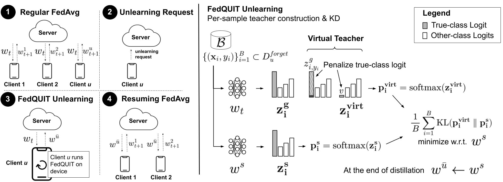

# FedQUIT: On-Device Federated Unlearning via a Quasi-Competent Virtual Teacher
This is the official repository for FedQUIT: On-Device Federated Unlearning via a Quasi-Competent Virtual Teacher.

## Overview of FedQUIT


## Preliminaries
The simulation code in this repository mainly leverages TensorFlow (TF). 
Python virtual env is managed via Poetry.
See `federated_fedquit/pyproject.toml`. To reproduce our virtual env,
follow the instructions in the Environment Setup section of this readme.

The code in this repository has been tested on Ubuntu 22.04.3,
and with Python version `3.10.13`.

## Environment Setup
By default, Poetry will use the Python version in your system. 
In some settings, you might want to specify a particular version of Python 
to use inside your Poetry environment. You can do so with `pyenv`. 
Check the documentation for the different ways of installing `pyenv`,
but one easy way is using the automatic installer:

```bash
curl https://pyenv.run | bash
```
You can then install any Python version with `pyenv install <python-version>`
(e.g. `pyenv install 3.9.17`) and set that version as the one to be used. 
```bash
# cd to your federated_fedquit directory (i.e. where the `pyproject.toml` is)
pyenv install 3.10.12

pyenv local 3.10.12

# set that version for poetry
poetry env use 3.10.12
```
To build the Python environment as specified in the `pyproject.toml`, use the following commands:
```bash
# cd to your federated_fedquit directory (i.e. where the `pyproject.toml` is)

# install the base Poetry environment
poetry install

# activate the environment
poetry shell

# intall tensorflow + cuda gpu support (retry again if error appears)
pip install tensorflow[and-cuda]=="2.15.0.post1"

pip install hydra-core=="1.3.2"

# this is needed for cub-200 dataset
pip install -U tfds-nightly
pip install opencv-python-headless=="4.9.0.80"

# this is needed for transformer architecture
pip install ml-collections=="0.1.1"
pip install tensorflow-hub=="0.14.0"
pip install huggingface-hub=="0.17.3"
pip install transformers=="4.34.0"
```

## Creating Client Datasets
To exactly reproduce the label distribution we used in the paper run the following lines of code.
Note that we use the txt files in `client_data` folder to make deterministic the partition.

```bash
python -m federated_fedquit.dataset_preparation dataset="cifar100" alpha=0.1 total_clients=10

## For IID data, we alpha==-1 as below
python -m federated_fedquit.dataset_preparation dataset="cifar100" alpha=-1 total_clients=10

python -m federated_fedquit.dataset_preparation dataset="cifar10" alpha=0.3 total_clients=10

## For CUB-200 dataset, we informally call it "birds" in this repository
python -m federated_fedquit.dataset_preparation dataset="birds" alpha=0.1 total_clients=10
```

## Running the Simulations
We prepared three scripts to run the experiments reported in the paper.
Before running the scripts, note the following:
* Note that this scripts save model checkpoints on disk (it can occupy 20-40 GB in total depending on the frequency of checkpoint).
* The model checkpoints for regular training (Original baseline) will be saved in a new folder `model_checkpoints/<dataset_config>/<training_config>`.
* The model checkpoints for the Retrain baseline will be saved in a new folder `model_checkpoint_retrained/<dataset_config>/<training_config>`. 
* The model checkpoints after unlearning, before recovery (post-unlearning in the paper) will be saved in `model_checkpoints/<dataset_config>/<training_config>/<baseline>`.
* In particular, for FedQUIT in `model_checkpoints/<dataset_config>/<training_config>/<logit_v_<v_tuning_kd_loss_choiche>`.
* The model checkpoints for the recovery, after unlearning running FL rounds until model utility is recovered will be saved in `model_checkpoints_resumed/<dataset_config>/<training_config>/<baseline>`.
* In particular, for FedQUIT in `model_checkpoints_resumed/<dataset_config>/<training_config>/<logit_v_<v_tuning_kd_loss_choiche>`.
* Note that we run simulations for each client working as the target client (one Original model, K Retrain models with K clients, K post-unlearning models, K post-recovery models).
* Each of the provided scripts below, run the following: (1) Train the Original model; (2) Train K Retrain models; (3) Generate K unlearned models via FedQUIT (with default config described in the paper); (4) Run the recovery phases and generate K post-recovery models.
```bash
bash ./federated_fedquit/simulation_manager_cifar10.sh

bash ./federated_fedquit/simulation_manager_cifar100_niid.sh

bash ./federated_fedquit/simulation_manager_cifar100_iid.sh

bash ./federated_fedquit/simulation_manager_cub200.sh
```
